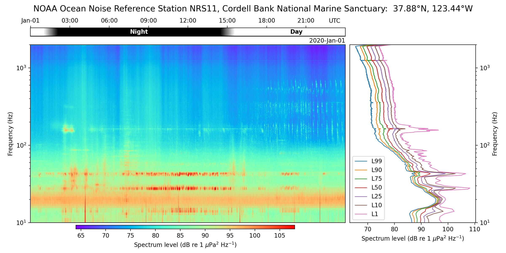

# HMB Plotting

`pbp-hmb-plot` is a utility program to plot the resulting HMB product.
It accepts one or more NetCDF files and generates a summary plot for each.
Various options are available to customize the plot.

Typically, the following options are used: 

| Option       | To indicate   |
| ------------ |--------------- |
| `--title`    | Title for the plot |
| `--latlon`   | Lat/Lon for solar position calculation |
| `--ylim`     | Limits for the y-axis |
| `--cmlim`    | Parameters passed to [pcolormesh] |

[pcolormesh]: https://matplotlib.org/stable/api/_as_gen/matplotlib.pyplot.pcolormesh.html#matplotlib-pyplot-pcolormesh

For example:

```text
pbp-hmb-plot \
     --title "NOAA Ocean Noise Reference Station NRS11, Cordell Bank National Marine Sanctuary:  37.88°N, 123.44°W" \
     --latlon 37.88 -123.44 \
     --ylim 10 2000 \
     --cmlim 64 108 \
     NRS11_20200101.nc
```
will generate `NRS11_20200101.jpg` with the following plot:

{ width="80%" loading=lazy }


## Usage

```shell
pbp-hmb-plot --help
```
```text
usage: pbp-hmb-plot [-h] [--version] [--latlon lat lon] [--title string] [--ylim lower upper] [--cmlim vmin vmax] [--dpi value] [--show] [--only-show]
               netcdf [netcdf ...]

Generate summary plots for given netcdf files.

positional arguments:
  netcdf              netcdf file(s) to plot

optional arguments:
  -h, --help          show this help message and exit
  --version           show program's version number and exit
  --latlon lat lon    Lat/Lon for solar position calculation . Default: (36.7128, -122.186)
  --title string      Title for the plot. Default: 'MBARI MARS Cabled Observatory   Monterey Bay, California, USA   36.7128 °N, -122.186 °W'
  --ylim lower upper  Limits for the y-axis. Default: (10, 100000)
  --cmlim vmin vmax   Parameters passed to pcolormesh. Default: (32, 108)
  --dpi value         DPI to use for the plot. Default: 200
  --show              Also show the plot
  --only-show         Only show the plot (do not generate .jpg files)
```

